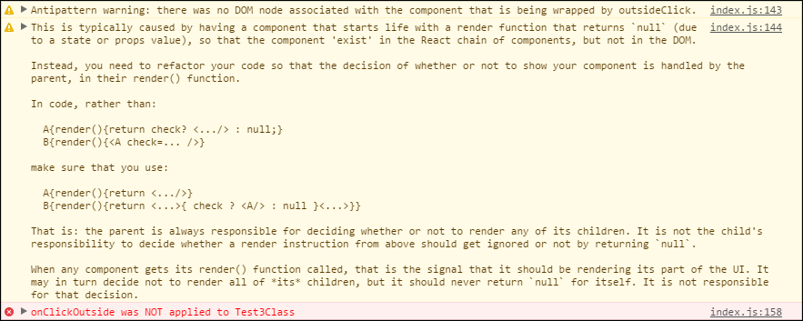

# An onClickOutside wrapper for React components

This is a React **H**igher **O**rder **C**omponent that you can use with your own React components if you want to have them listen for clicks that occur somewhere in the document, outside of the element itself (for instance, if you need to hide a menu when people click anywhere else on your page).

Note that this HOC relies on the `.classList` property, which is supported by all modern browsers, but not by no longer supported browsers like IE9 or older. If your code relies on classList in any way, you want to use a polyfill like [dom4](https://github.com/WebReflection/dom4)

This HOC supports stateless components as of v5.7.0

## Installation

Use `npm`:

```
$> npm install react-onclickoutside --save
```

(or `--save-dev` depending on your needs). You then use it in your components as:

```js
// load the HOC:
var onClickOutside = require('react-onclickoutside');

// create a new component, wrapped by this onclickoutside HOC:
var MyComponent = onClickOutside(React.createClass({
  ...,
  handleClickOutside: function(evt) {
    // ...handling code goes here...
  },
  ...
}));

```

or:

```js
// ES6 Class Syntax
import React, { Component } from 'react'
import onClickOutside from 'react-onclickoutside'

class MyComponent extends Component {
  handleClickOutside = evt => {
    // ..handling code goes here...
  }
}

export default onClickOutside(MyComponent)
```

Note that if you try to wrap a React component class without a `handleClickOutside(evt)` handler like this, the HOC will throw an error. In order to use a custom event handler, you can specify the function to be used by the HOC as second parameter
(this can be useful in environments like TypeScript, where the fact that the wrapped component does not implement the handler can be flagged at compile-time):

```js
// load the HOC:
var onClickOutside = require('react-onclickoutside');

// create a new component, wrapped by this onclickoutside HOC:
var MyComponent = onClickOutside(React.createClass({
  ...,
  myClickOutsideHandler: function(evt) {
    // ...handling code goes here...
  },
  ...
}), {
  handleClickOutside: function(instance) {
    return instance.myClickOutsideHandler;
  }
});

```

Note that if you try to wrap a React component with a custom handler that the component does not implement, the HOC will throw an error at run-time.

### IMPORTANT: Make sure there are DOM nodes to work with.

If you are using this HOC to toggle visibility of UI elements, make sure you understand how responsibility for this works in React. While in a traditional web setting you would simply call something like `.show()` and `.hide()` on a part of the UI you want to toggle visibility for, using CSS properties, React instead is about *simply not showing UI unless it should be visible*.

As such, doing **the following is a guaranteed error** for onClickOutside:
```js
class InitiallyHidden extends React.Component {
  constructor(props) {
    super(props);
  }
  render() {
    return this.props.hidden ? null : <div>...loads of content...</div>;
  }
  handleClickOutside() {
    this.props.hide();
  }
}

const A = onClickOutside(InitiallyHidden);

class UI extends React.Component {
  constructor(props) {
    super(props);
    this.state = {
      hideThing: true
    }
  }
  render() {
    return <div>
      <button onClick={e => this.showContent() }>click to show content</button>
      <A hidden={this.state.hideThing} hide={e => this.hideContent() }/>
    </div>;
  }
  showContent() {
    this.setState({ hideThing: false });
  }
  hideContent() {
    this.setState({ hideThing: true });
  }
}
```

Running this code will result in a console log that looks like this:



The reason this code will fail is that this component can mount *without* a DOM node backing it. Writing a `render()` function like this is somewhat of an antipattern: a component should assume that *if* its render function is called, it should render. It should *not* potentially render nothing.

Instead, the parent should decide whether some child component should render at all, and any component should assume that when its `render()` function is called, it should render itself.

A refactor is typically trivially effected, and **the following code will work fine**:

```js
class InitiallyHidden extends React.Component {
  constructor(props) {
    super(props);
  }
  render() {
    return <div>...loads of content...</div>;
  }
  handleClickOutside() {
    this.props.hide();
  }
}

const A = onClickOutside(InitiallyHidden);

class UI extends React.Component {
  constructor(props) {
    super(props);
    this.state = {
      hideThing: true
    }
  }
  render() {
    return <div>
      <button onClick={e => this.showContent() }>click to show content</button>
      { this.state.hideThing ? null : <A hide={e => this.hideContent() }/> }
    </div>;
  }
  showContent() {
    this.setState({ hideThing: false });
  }
  hideContent() {
    this.setState({ hideThing: true });
  }
}
```

Here we have code where each component trusts that its `render()` will only get called when there is in fact something to render, and the `UI` component does this by making sure to check what *it* needs to render.

The onOutsideClick HOC will work just fine with this kind of code.

## Regulate which events to listen for

By default, "outside clicks" are based on both `mousedown` and `touchstart` events; if that is what you need, then you do not need to specify anything special. However, if you need different events, you can specify these using the `eventTypes` property. If you just need one event, you can pass in the event name as plain string:

```js
<MyComponent eventTypes="click" ... />
```

For multiple events, you can pass in the array of event names you need to listen for:

```js
<MyComponent eventTypes={["click", "touchend"]} ... />
```

## Regulate whether or not to listen for outside clicks

Wrapped components have two functions that can be used to explicitly listen for, or do nothing with, outside clicks

- `enableOnClickOutside()` - Enables outside click listening by setting up the event listening bindings.
- `disableOnClickOutside()` - Disables outside click listening by explicitly removing the event listening bindings.

In addition, you can create a component that uses this HOC such that it has the code set up and ready to go, but not listening for outside click events until you explicitly issue its `enableOnClickOutside()`, by passing in a properly called `disableOnClickOutside`:

```js
var onClickOutside = require('react-onclickoutside');

var MyComponent = onClickOutside(React.createClass({
  ...,
  handleClickOutside: function(evt) {
    // ...
  },
  ...
}));

var Container = React.createClass({
  render: function(evt) {
    return <MyComponent disableOnClickOutside={true} />
  }
});
```

Using `disableOnClickOutside()` or `enableOnClickOutside()` within `componentDidMount` or `componentWillMount` is considered an anti-pattern, and does not have consistent behaviour when using the mixin and HOC/ES7 Decorator. Favour setting the `disableOnClickOutside` property on the component.

## Regulate whether or not to listen to scrollbar clicks

By default this HOC will listen for "clicks inside the document", which may include clicks that occur on the scrollbar. Quite often clicking on the scrollbar *should* close whatever is open but in case your project invalidates that assumption you can use the `excludeScrollbar` property to explicitly tell the HOC that clicks on the scrollbar should be ignored:

```js
var onClickOutside = require('react-onclickoutside');

var MyComponent = onClickOutside(React.createClass({
  ...
}));

var Container = React.createClass({
  render: function(evt) {
    return <MyComponent excludeScrollbar={true} />
  }
});
``` 

Alternatively, you can specify this behavior as default for all instances of your component passing a configuration object as second parameter:

```js
var MyComponent = onClickOutside(React.createClass({
  ...
}), {
  excludeScrollbar: true
});
``` 

## Regulating `evt.preventDefault()` and `evt.stopPropagation()`

Technically this HOC lets you pass in `preventDefault={true/false}` and `stopPropagation={true/false}` to regulate what happens to the event when it hits your `handleClickOutside(evt)` function, but beware: `stopPropagation` may not do what you expect it to do.

Each component adds new event listeners to the document, which may or may not cause as many event triggers as there are event listening bindings. In the test file found in `./test/browser/index.html`, the coded uses `stopPropagation={true}` but sibling events still make it to "parents".

## Marking elements as "skip over this one" during the event loop

If you want the HOC to ignore certain elements, you can tell the HOC which CSS class name it should use for this purposes. If you want explicit control over the class name, use `outsideClickIgnoreClass={some string}` as component property, or if you don't, the default string used is `ignore-react-onclickoutside`.

## Older React code: "What happened to the Mixin??"

Due to ES2015/ES6 `class` syntax making mixins essentially impossible, and the fact that HOC wrapping works perfectly fine in ES5 and older versions of React, as of this package's version 5.0.0 no Mixin is offered anymore.

If you *absolutely* need a mixin... you really don't.

### But how can I access my component? It has an API that I rely on!

No, I get that. I constantly have that problem myself, so while there is no universal agreement on how to do that, this HOC offers a `getInstance()` function that you can call for a reference to the component you wrapped, so that you can call its API without headaches:

```js
var onClickOutside = require('react-onclickoutside');

var MyComponent = onClickOutside(React.createClass({
  ...,
  handleClickOutside: function(evt) {
    // ...
  },
  ...
}));

var Container = React.createClass({
  someFunction: function() {
    var ref = this.refs.mycomp;
    // 1) Get the wrapped component instance:
    var superTrueMyComponent = ref.getInstance();
    // and call instance functions defined for it:
    superTrueMyComponent.customFunction();
  },

  render: function(evt) {
    return <MyComponent disableOnClickOutside={true} ref="mycomp"/>
  }
});
```

Note that there is also a `getClass()` function, to get the original Class that was passed into the HOC wrapper, but if you find yourself needing this you're probably doing something wrong: you really want to define your classes as real, require'able etc. units, and then write wrapped components separately, so that you can always access the original class's `statics` etc. properties without needing to extract them out of a HOC.

## Which version do I need for which version of React?

If you use **React 0.12 or 0.13**, **version 2.4 and below** will work.

If you use **React 0.14**, use **v2.5 through v4.9**, as these specifically use `react-DOM` for the necessary DOM event bindings.

If you use **React 15** (or higher), you can use **v4.x, which offers both a mixin and HOC, or use v5.x, which is HOC-only**.

### Support-wise, only the latest version will receive updates and bug fixes.

I do not believe in perpetual support for outdated libraries, so if you find one of the older versions is not playing nice with an even older React: you know what to do, and it's not "keep using that old version of React".

## IE does not support classList for SVG elements!

This is true, but also an edge-case problem that only exists for older versions of IE (including IE11), and should be addressed by you, rather than by  thousands of individual libraries that assume browsers have proper HTML API implementations (IE Edge has proper `classList` support even for SVG).

If you need this to work, you can add a shim for `classList` to your page(s), loaded before you load your React code, and you'll have instantly fixed *every* library that you might remotely rely on that makes use of the `classList` property. You can find several shims quite easily, a good one to start with is the [dom4](https://github.com/WebReflection/dom4) shim, which adds all manner of good DOM4 properties to "not quite at DOM4 yet" browser implementations.

Eventually this problem will stop being one, but in the mean time *you* are responsible for making *your* site work by shimming everything that needs shimming for IE.  As such, **if you file a PR to fix classList-and-SVG issues specifically for this library, your PR will be closed and I will politely point you to this README.md section**. I will not accept PRs to fix this issue. You already have the power to fix it, and I expect you to take responsibility as a fellow developer to shim what you need instead of getting obsolete quirks supported by libraries whose job isn't to support obsolete quirks.
